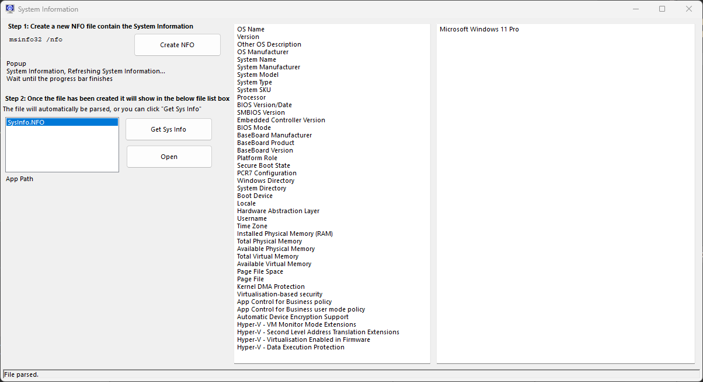
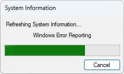
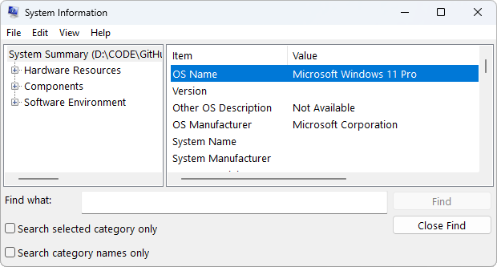

# January

Month: [January](../../docs/january.md)

Project: [twinBASICMonthlyChallenge1.twinproj](january/twinBASICMonthlyChallenge1.twinproj)

📁: [twinBASICMonthlyChallenge1](twinBASICMonthlyChallenge1/) 

---

## Process

Windows Form

**Step 1** - Create a new NFO file containing the _System Information_

Click the _Create NFO_ button.

`msinfo32 /nfo <FILEPATH>`

Popup

> System Information  
> Refreshing System Information...

Wait until the progress bar finishes

A `Timer` has been started on the Form and refreshes the `FileListBox` every **5** seconds. This is a hacky workaround. 

Once this has completed the `FileListBox` will refresh with any files filtered by "*.NFO", the two buttons become enabled and it will be automatically populated on the right hand side.

This is an XML file, so the program uses the _MSXML2_ library to parse the file to get the first Category which is "System Summary" (`Category name="System Summary"`) and grabs each of the `Data` (`/MsInfo/Category/Data`) nodes of `Item` and `Value` and populates 2 ListBoxes.

If an existing .NFO is already in the same folder as the app you can select it and the same buttons are enabled.

You can also click "Open" to open the file using the default program of _msinfo32.exe_ (`C:\Windows\System32\msinfo32.exe`).

This has other properties including _Hardware Resources_, _Components_ and _Software Environment_ which aren't parsed/displayed in the app, but could be in a future update.

### TODO

Parse the other nodes like Hardware Resources/Components/Software Environment.

## References

- **MSXML2** - `C:\Windows\SysWOW64\msxml6.dll`

MS Learn: [List of Microsoft XML parser (MSXML) versions](https://learn.microsoft.com/en-us/previous-versions/troubleshoot/msxml/list-of-xml-parser-versions)

## Alternatives

**Class: OSInfo in Category Windows : System Information from Total Visual SourceBook**  
_Obtain information from the Windows operating system in VB6 and VBA with 32 and 64-bit Windows API calls._  
https://www.fmsinc.com/microsoftaccess/modules/code/Windows/SystemInformation/OSInfo_class.htm  

_Visual Basic System Services_  
**GetSystemInfo: System Processor Information**  
http://vbnet.mvps.org/index.html?code/system/getsysteminfo.htm  

_Visual Basic File API Routines_  
**FindFirstChangeNotification: Create a 'Watched' Folder**  
http://vbnet.mvps.org/index.html?code/fileapi/watchedfolder.htm  

**[VBCCR](https://github.com/Kr00l/VBCCR)** SysInfo Control.

